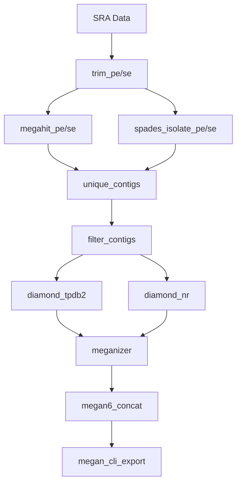

# Workflow Rules Documentation

This document describes the individual rules and steps in the project-tobamo Snakemake workflow.

## Overview

The workflow consists of several rule files located in `workflow/rules/`:

- `trim.smk` - Quality control and adapter trimming
- `assembly.smk` - De novo assembly
- `diamond.smk` - Protein database searches  
- `filtering.smk` - Contig filtering and processing
- `megan6.smk` - Taxonomic classification

## Rule Details

### 1. Quality Control and Trimming (`trim.smk`)

#### `trim_pe` - Paired-end read trimming
- **Input:** Raw paired-end FASTQ files from SRA
- **Tool:** Trimmomatic
- **Parameters:**
  - ILLUMINACLIP: Adapter removal
  - LEADING:3 TRAILING:3: Quality trimming
  - MINLEN:36: Minimum read length
- **Output:** Paired and unpaired trimmed reads

#### `trim_se` - Single-end read trimming  
- **Input:** Raw single-end FASTQ files
- **Tool:** Trimmomatic
- **Output:** Trimmed single-end reads

### 2. Assembly (`assembly.smk`)

#### `megahit_pe` - MEGAHIT paired-end assembly
- **Input:** Trimmed paired-end reads
- **Tool:** MEGAHIT
- **Parameters:** Optimized for metagenomic data
- **Output:** Assembled contigs

#### `megahit_se` - MEGAHIT single-end assembly
- **Input:** Trimmed single-end reads
- **Tool:** MEGAHIT
- **Output:** Assembled contigs

#### `spades_isolate_pe` - SPAdes paired-end assembly
- **Input:** Trimmed paired-end reads
- **Tool:** SPAdes (isolate mode)
- **Output:** Alternative assembly contigs

#### `spades_isolate_se` - SPAdes single-end assembly
- **Input:** Trimmed single-end reads  
- **Tool:** SPAdes (isolate mode)
- **Output:** Alternative assembly contigs

### 3. Contig Processing (`filtering.smk`)

#### `unique_contigs` - Combine and deduplicate contigs
- **Input:** MEGAHIT and SPAdes assemblies
- **Process:** 
  - Combines contigs from both assemblers
  - Removes duplicates and short sequences
  - Filters by minimum length
- **Output:** Unique contig set

#### `filter_contigs` - Apply quality filters
- **Input:** Unique contigs
- **Process:**
  - Length filtering
  - Quality score filtering
  - Coverage filtering
- **Output:** High-quality filtered contigs

### 4. Database Searches (`diamond.smk`)

#### `diamond_tpdb2` - Tobamovirus protein search
- **Input:** Filtered contigs
- **Database:** tpdb2.dmnd (tobamovirus proteins)
- **Tool:** Diamond BLASTx
- **Parameters:**
  - Ultra-sensitive mode
  - E-value threshold: 1e-5
- **Output:** Viral protein matches

#### `diamond_nr` - NCBI NR protein search
- **Input:** Filtered contigs
- **Database:** nr.dmnd (NCBI non-redundant)
- **Tool:** Diamond BLASTx
- **Parameters:**
  - Sensitive mode
  - E-value threshold: 1e-3
- **Output:** Taxonomic protein matches

### 5. Taxonomic Classification (`megan6.smk`)

#### `meganizer` - Prepare MEGAN analysis files
- **Input:** Diamond search results
- **Tool:** MEGAN6 meganizer
- **Process:** Converts Diamond output to MEGAN format
- **Output:** .rma6 files for MEGAN analysis

#### `megan6_concat` - Combine MEGAN results
- **Input:** .rma6 files from both searches
- **Tool:** MEGAN6
- **Process:** Merges viral and NR search results
- **Output:** Combined MEGAN analysis file

#### `megan_cli_export` - Export final results
- **Input:** Combined MEGAN file
- **Tool:** MEGAN6 command-line interface
- **Process:** 
  - Applies taxonomic filters
  - Exports classification results
  - Generates summary statistics
- **Output:** Final CSV results file

## Resource Requirements

### Memory Requirements by Rule

> **Note:** The following memory requirements are estimates based on typical usage patterns and may vary depending on your specific data size, system configuration, and input parameters. Monitor actual resource usage and adjust accordingly for your environment.

| Rule | Memory | Notes |
|------|--------|--------|
| trim_pe/se | 4GB | Per sample |
| megahit_* | 16-32GB | Depends on data size |
| spades_* | 32-64GB | Memory-intensive |
| diamond_* | 8-16GB | Depends on database size |
| megan6_* | 8GB | Per sample |

### Thread Usage

| Rule | Threads | Scalability |
|------|---------|-------------|
| trim_* | 4 | Good |
| megahit_* | 8-16 | Excellent |
| spades_* | 8-16 | Good |
| diamond_* | 8-32 | Excellent |
| megan6_* | 1-4 | Limited |

## Runtime Estimates

Approximate runtime for different dataset sizes:

### Single Sample (typical SRA run)
- Trimming: 10-30 minutes
- Assembly: 1-4 hours
- Diamond searches: 2-8 hours
- MEGAN analysis: 30-60 minutes
- **Total: 4-13 hours per sample**

### Full Dataset (279 samples)
- With 32 cores: ~2-4 weeks
- With 64 cores: ~1-2 weeks
- Bottlenecks: Assembly and Diamond NR search

## Workflow Dependencies



## Error Handling

### Common Rule Failures

1. **Assembly failures:**
   - Usually due to insufficient memory
   - Check available RAM vs. requirements
   - Consider reducing thread count

2. **Diamond search timeouts:**
   - Large NR database searches can be slow
   - Monitor disk I/O and memory usage
   - Consider using faster storage (SSD)

3. **MEGAN processing errors:**
   - Check input file formats
   - Verify database file integrity
   - Ensure sufficient temporary space

### Recovery Strategies

```bash
# Restart failed jobs only
snakemake --use-conda -c32 -p -k --rerun-incomplete

# Force rerun specific rule
snakemake --use-conda -c32 -p -R diamond_nr

# Debug specific sample
snakemake --use-conda -c4 -p results/SRR1234567/09_SRR1234567_megan6_results.csv
```

## Customization

### Modifying Parameters

Edit rule files to customize:

1. **Quality thresholds:**
```snakemake
# In trim.smk
LEADING:3 TRAILING:3 MINLEN:36  # Adjust quality parameters
```

2. **Assembly parameters:**
```snakemake
# In assembly.smk
--min-contig-len 200  # Adjust minimum contig length
```

3. **Search sensitivity:**
```snakemake
# In diamond.smk
--ultra-sensitive --evalue 1e-5  # Adjust sensitivity
```

### Adding New Rules

To add custom processing steps:

1. Create new rule file in `workflow/rules/`
2. Include in main `Snakefile`
3. Update dependencies and outputs
4. Test with dry run

## Performance Optimization

### For Different Systems

**High-memory systems:**
- Increase assembly memory allocation
- Run more samples in parallel

**High-CPU systems:**
- Increase thread counts for parallel rules
- Optimize Diamond search parallelization

**Storage-limited systems:**
- Clean intermediate files regularly
- Use temporary directories for large files
- Compress outputs when possible
